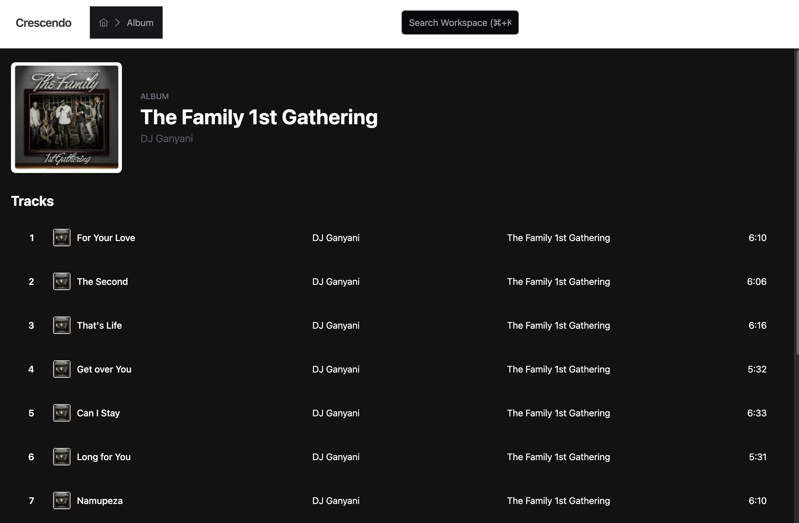
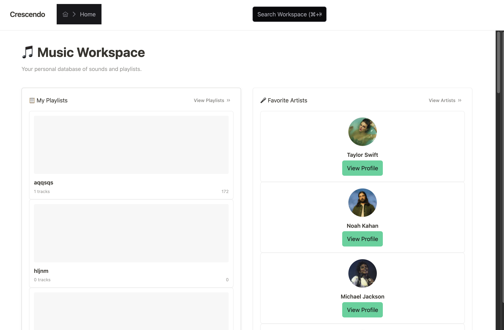
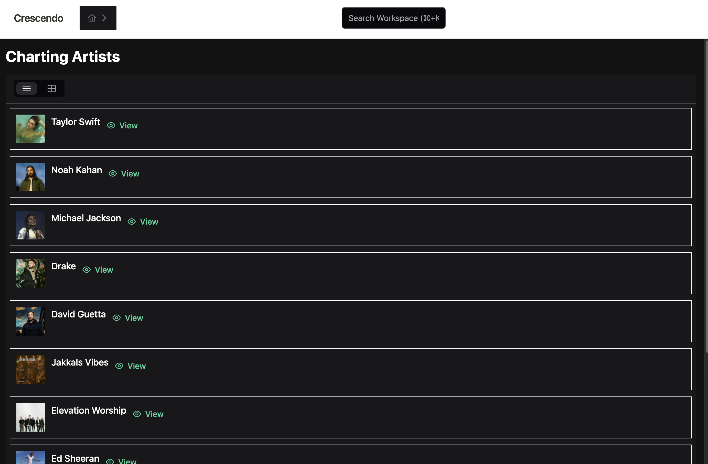
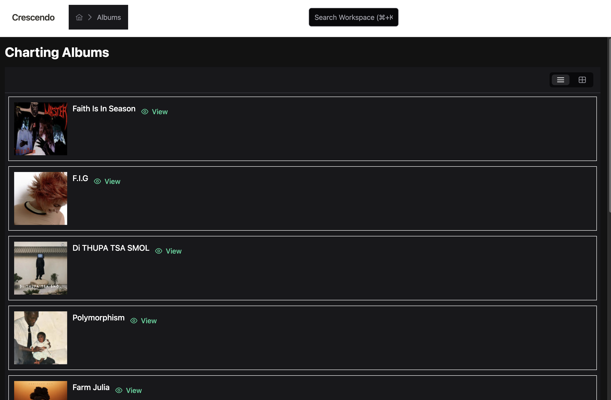
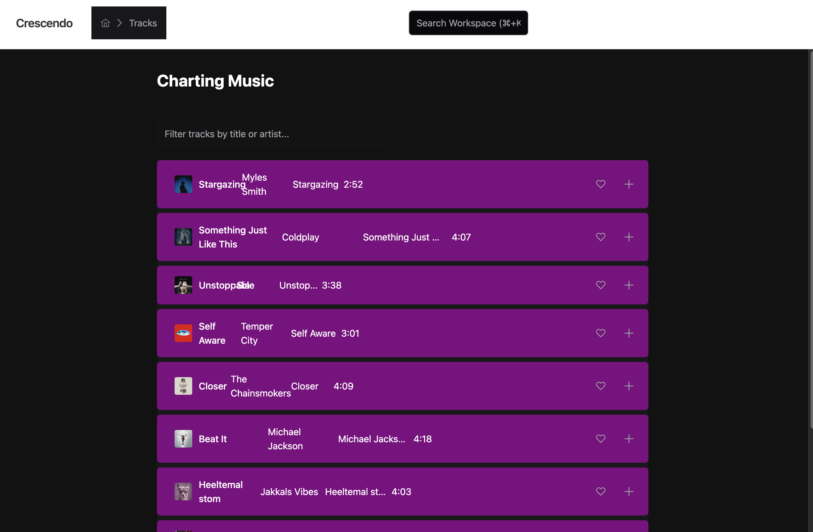
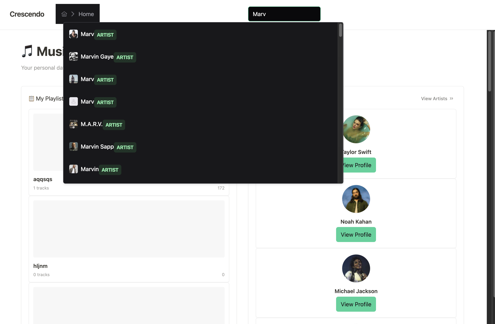
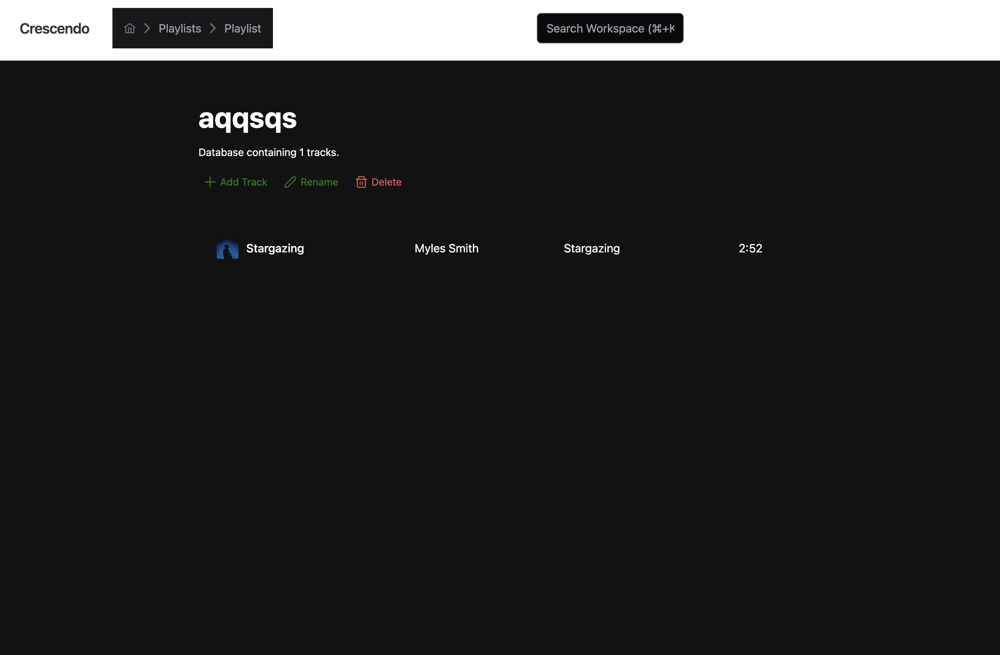
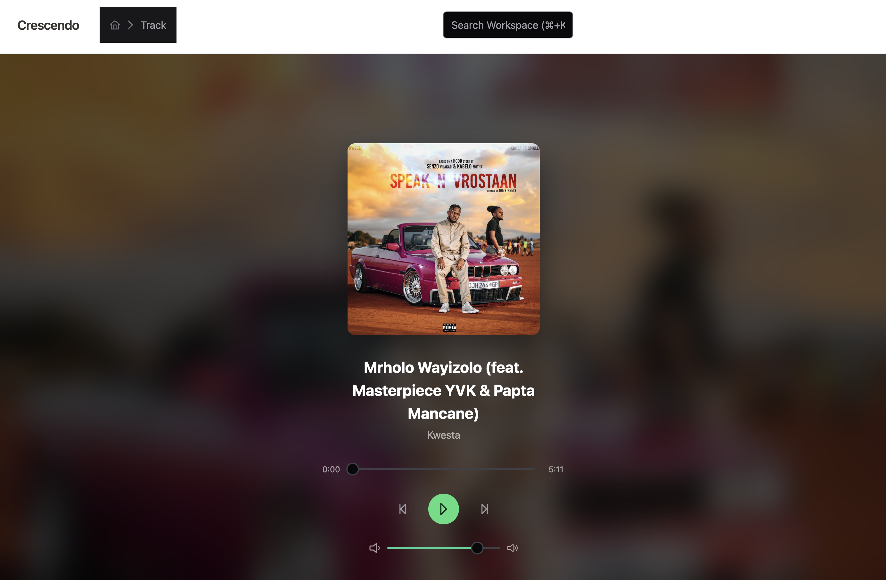
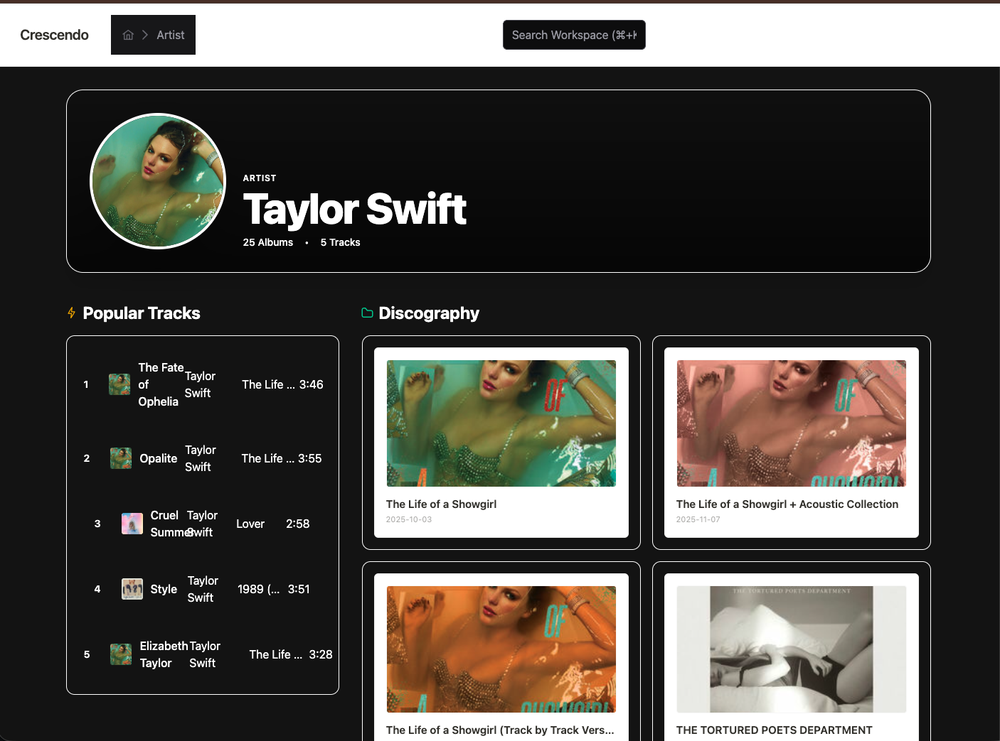

# **Crescendo 🎵**

### *A high-performance Music Database & Workspace*

Crescendo is a modern web application built for music enthusiasts to explore artists, albums, and manage personal collections. It bridges the gap between a streaming interface and a productivity workspace, utilizing a Notion-style layout for better data organization.

**[ 🔗 View Live Production Site ]()**

---

## **📸 Screenshots**

## 📸 Gallery

| Album view |Home View |  Charts view |
| :---: | :---: | :---: |
|  |  |  |
| **Charts View** | **Charts view** | **Search Pallette** |
|  |  |  |
| **Playlisy View** | **Track Playing view** | Artist View|
|  |  |  |
---

## **🛠️ Tech Stack & Architecture**

### **Core Framework**

* **Angular 18+**: Leveraging the latest **Signals** API for granular reactivity and high-performance UI updates.
* **TypeScript**: Strictly typed interfaces for all API entities (Artists, Albums, Tracks) to ensure compile-time safety.

### **State & Storage**

* **Signal Store**: Used as the primary mechanism to sync playlists and playback state across the application without the boilerplate of NgRx.
* **IndexedDB**: Implemented for local-first persistence. Your playlists and preferences are stored directly in the browser, allowing for offline access and instant load times on return visits.

### **UI & Styling**

* **PrimeNG**: The component library powers the data-heavy elements like the track tables, sidebar menus, and interactive buttons.
* **CSS Flexbox/Grid**: A custom layout wrapper system provides the "Notion-style" side-by-side workspace experience.

### **Data Source**

* **Deezer API**: Integrated via a secure **Angular Proxy** configuration to bypass CORS during development and provide real-time access to a global music catalog.

---

## **Getting Started**

### **1. Prerequisites**

* Node.js (LTS version)
* Angular CLI (`npm install -g @angular/cli`)

### **2. Installation**

```bash
git clone
cd ANGULAR-ASSESSMENT-LOBOGANG
npm install

```

### **3. Development Server**

Run `ng serve` for a dev server. Navigate to `http://localhost:4200/`. The app will automatically reload if you change any of the source files.

> **Note:** The project uses a `proxy.conf.json` to handle Deezer API requests. Ensure you start the server using the standard `ng serve` which is pre-configured to pick up this file.


---

## **🔒 Security & Performance**

* **Strict Typing**: Zero `any` policy across the codebase for better maintainability.
* **Atomic Updates**: Components use parallel fetching (`Promise.all`) and Signal updates to prevent UI flickering.
* **Safe Navigation**: Route guards and resolvers ensure that components never initialize without the data they need.

---

### **License**

This project is licensed under the MIT License.